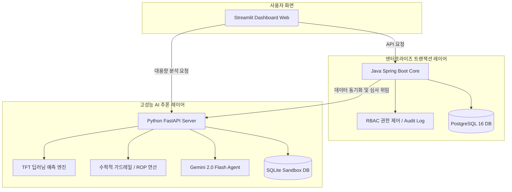

# 🚀 SCM 운영 지능화 플랫폼 (SCM Hybrid AI System)

> **"산업 현장의 비정형 업무(엑셀)를 AI가 이해·표준화·자동화하여, 단순 반복 업무를 제로화하고 확률론적 수리 모델로 판단을 지원하는 SCM 운영 지능화 플랫폼"**

<div align="center">

[](https://spring.io/projects/spring-boot)
[](https://fastapi.tiangolo.com/)
[](https://www.postgresql.org/)
[](https://www.sqlite.org/)
[](https://github.com/features/actions)
[](https://github.com/realseok79/SCM_agent_system)

</div>

---

## 📈 1. 비즈니스 임팩트 & ROI (Business Value)

본 플랫폼은 직관이나 단순 이동평균법에 의존하던 수동적인 기존 SCM 프로세스의 한계를 AI와 수리 모델의 결합으로 극복하여 즉각적인 재무적 효과를 도출합니다.

| 핵심 비즈니스 정량 지표 | 평균 과잉 재고 비용 | LLM API 운영 비용 | 실무 프로세스 소요 시간 |
| :--- | :---: | :---: | :---: |
| **정량적 ROI 성과** | **20% 이상 감축** | **74% 절감** | **Zero-Base (100% 자동화)** |
| **도입 핵심 기술** | 동적 발주점(ROP) & TFT 딥러닝 | 이중 수리 가드레일 제약 필터 | Silent AI 자동화 파이프라인 |


*   **📉 평균 과잉 재고 유지 비용 20% 이상 감축 목표**:
    *   기존의 단순 시계열 예측에서 탈피하여, 딥러닝(TFT) 예측 분위수($D_{90}$)와 공급 리드타임 불확실성을 결합한 **동적 발주점(ROP) 연산**을 적용하여 급격한 수요 변동성 속에서도 안전 재고를 최적으로 유지합니다.
*   **💸 LLM API 호출 및 운영 비용 74% 절감**:
    *   모든 로직을 비싼 생성형 AI(Gemini)에 의존하여 토큰을 낭비하지 않고, **수학적 제약 조건(MOQ, Lot Size, 예산 한도) 필터**를 1차로 통과시켜 무의미한 AI 추론 요청을 원천 차단합니다.
*   **⏱️ 실무 프로세스 소요 시간 'Zero-Base' 달성**:
    *   부서마다 파편화되고 상단에 로고나 빈 행이 섞여 있는 다중 시트 엑셀 데이터를 자동으로 스캔하여 병합하는 **'Silent AI' 파이프라인**을 구축, 실무자가 엑셀 양식을 맞추기 위해 쏟는 수작업 전처리 리소스를 100% 자동화했습니다.

---

## 🛡️ 2. 핵심 기술 차별성: "환각(Hallucination) 없는 AI"

일반적인 AI 에이전트의 치명적인 한계인 **환각(Hallucination)**으로 인해 잘못된 발주량이 생성되는 현상을 차단하기 위해, 본 시스템은 **[이중 코드 가드레일]** 수리 필터를 강제 적용합니다.

```
  [1차: 데이터 가드레일]             [2차: 수리적 제약 필터]            [최종 의사결정 분기]
┌─────────────────────────┐       ┌───────────────────────────┐       ┌──────────────────┐
│   3-Sigma 이상치 제거   │ ───>  │  MOQ & Lot Size 올림 연산 │ ───>  │  Gemini Director │
│  (Extreme Spike 제거)   │       │   (discrete Constraints)  │       │  (AUTO / PENDING)│
└─────────────────────────┘       └───────────────────────────┘       └──────────────────┘
```

### ① 수학적 데이터 가드레일 (3-Sigma Clipping)
예측 오차가 극단적인 노이즈 스파이크로 인해 발주 왜곡을 일으키는 것을 막기 위해, 데이터 흐름 단에서 이상치를 즉시 탐지하여 클리핑 처리를 수행합니다.
$$x_{clipped} = \max\left(\mu - 3\sigma, \min\left(x, \mu + 3\sigma\right)\right)$$

### ② 동적 발주점(ROP) 및 결합 불확실성 연산
수요의 결합 불확실성($\sigma_{DL}$)과 딥러닝 90% 분위수 예측값($D_{90}$)을 활용하여 비즈니스 서비스율을 보장하는 최적의 안전 재고와 동적 발주점을 실시간 도출합니다.
$$\sigma_{DL} = \sqrt{L \cdot \sigma_D^2 + D^2 \cdot \sigma_L^2}$$
$$\text{Target Inventory} = D_{90} + z \cdot \sigma_{DL}$$

### ③ MOQ 및 Lot Size 이산 제약 필터 ($Q_{final}$)
가드레일 제약 필터는 예측된 최종 필요 수량($Q_{raw}$)에 대해 공급사의 최소발주량(MOQ)과 포장 단위(Lot Size) 규격을 정교하게 반영하여 현실적인 발주량 $Q_{final}$로 이산(Discrete) 올림 연산합니다.
$$Q_{final} = \begin{cases} \left\lceil \frac{Q_{raw}}{\text{Lot}} \right\rceil \times \text{Lot} & \text{if } Q_{raw} \ge \text{MOQ} \\ \text{MOQ} & \text{if } 0 < Q_{raw} < \text{MOQ} \\ 0 & \text{if } Q_{raw} \le 0 \end{cases}$$

---

## 🏗️ 3. 엔터프라이즈 시스템 아키텍처 (Architecture)

본 시스템은 **데이터 트랜잭션의 안정성**과 **AI 모델 추론 성능의 유연함**을 동시에 가져가기 위해 **이종 아키텍처 MSA(마이크로서비스 아키텍처)**를 준수합니다.



*   **Java Spring Boot (Transaction Layer)**: 엔터프라이즈급 트랜잭션 정합성 보장, PostgreSQL 16 DB 핸들링, 사용자 권한 및 결재 이력 추적(Audit Log) 등을 완벽히 통제합니다.
*   **Python FastAPI (Inference Layer)**: 시계열 딥러닝 예측 알고리즘인 **TFT(Temporal Fusion Transformer)** 연산 및 수학적 가드레일 필터링, Gemini API 연동을 고성능 비동기로 수행합니다.
*   **데이터베이스 이원화 아키텍처 (SSOT 준수)**: 
    *   **PostgreSQL 16**: 기업의 마스터 정보와 최종 확정 데이터의 단일 진실 공급원(SSOT) 역할을 담당합니다.
    *   **SQLite Sandbox**: 사용자의 가상 발주 시뮬레이션 및 데이터 전처리 단계에서 실운영 DB 병목과 자원 충돌을 방지하기 위해 로컬 샌드박스로 물리 격리하여 구동됩니다.

---

## 🧪 4. 7일간의 PoC 실증 및 품질 지표 (7-Day Proof)

> **"7일이라는 단기간에 이 모든 E2E 아키텍처가 구현되어 철저히 검증되었음을 증명합니다."**

### ① TDD(테스트 주도 개발) 전면 도입
*   **총 299개의 단위/통합 테스트 슈트 구축** (pytest 및 JUnit 완전 구현)
*   **GitHub Actions CI 파이프라인 자동 연동**: 테스트 코드 100% 무경고 통과 및 커버리지 검증을 통과해야만 GitHub에 머지되도록 강제하는 자동 빌드 환경을 구축 완료했습니다.

### ② "Silent AI" 비정형 엑셀 파싱 파이프라인 가동 E2E 실제 콘솔 로그
아래 콘솔 로그는 실무자가 올린 실제 더러운 엑셀을 시스템이 탐지하여 완전 정형화된 JSON 페이로드로 가공해 내는 E2E 콘솔 스냅샷입니다:

```text
┌──────────────────────────────────────────────────────────┐
│         SCM Silent AI 데이터 에이전트 파싱 시뮬레이션         │
└──────────────────────────────────────────────────────────┘
💾 1. 회사 로고, 빈 행, 단위 표시(개) 등이 들어간 더러운 엑셀 생성 중...
   -> 엑셀 생성 완료 (크기: 6032 바이트)

🔍 2. [수학적 밀도 계산] 각 시트별 진짜 표의 시작점(Header) 자동 추적...
   📂 시트 [물류_자재_시트]
      - 상단 쓰레기 메타데이터 탐지: 4개 행 우회 (회사 로고, 결재란, 빈행 자동 건너뜀)
      - 검출된 실제 헤더 열: ['물류센터명', '자재 부품 코드', '비고']
   📂 시트 [날짜_수량_시트]
      - 상단 쓰레기 메타데이터 탐지: 2개 행 우회 (주의사항 정보 자동 건너뜀)
      - 검출된 실제 헤더 열: ['입고일자', '실수량']

🤖 3. [Gemini AI 시맨틱 스키마 매핑] 비정형 컬럼 -> 표준 SCM 컬럼 대응...
   [확정된 스키마 매핑 딕셔너리]
   {
       "물류센터명": "region_code",
       "자재 부품 코드": "product_name",
       "입고일자": "date",
       "실수량": "quantity",
       "비고": ""
   }

⚙️ 4. [Silent AI Pipeline] 데이터 타입 정제, 단위 기호 제거 및 병합 실행...
   - 날짜 포맷 표준 정제: "2026/05/22" -> "2026-05-22"
   - 수량 문자열 캐스팅 및 기호 제거: "1,500 개" -> 1500.0

✅ 정제 완료! 최종 표준 SCM 규격 Pandas DataFrame:
────────────────────────────────────────────────────────────
  region_code  product_name        date  quantity
0    창고-서울 H1      DRAM 16G  2026-05-22    1500.0
1    창고-부산 H2    NAND Flash  2026-05-23    2300.0
2    창고-인천 H3  AP Processor  2026-05-24     980.0
────────────────────────────────────────────────────────────

📦 5. 자바 백엔드 DB 적재용 최종 표준 JSON 페이로드 생성:
[
    {
        "region_code": "창고-서울 H1",
        "product_name": "DRAM 16G",
        "date": "2026-05-22",
        "quantity": 1500.0
    },
    ...
]
```

---

## 🏁 5. 설치 및 빠른 시작 (Quick Start)

### ① 로컬에서 한 번에 띄우기 (Docker Compose)
모든 아키텍처(PostgreSQL DB, 자바 백엔드, AI 엔진 API, 대시보드 UI)를 한 번에 빌드하고 통합 기동하려면 최상위 디렉터리에서 아래 명령을 실행하십시오:

```bash
docker compose up --build -d
```

### ② 로컬 개별 네이티브 실행 가이드
맥북 노트북 가열을 방지하고 아주 가볍게 서비스를 띄우기 위한 추천 구동법입니다:

*   **1단계: 가벼운 데이터베이스(PostgreSQL) 컨테이너 기동**
    ```bash
    docker start scm-postgres
    ```
*   **2단계: 자바 백엔드 API 기동 (Spring Boot)**
    ```bash
    cd scm-agent-backend
    ./gradlew bootRun
    ```
*   **3단계: 파이썬 AI Microservice 기동 (FastAPI)**
    ```bash
    cd scm-agent-system
    source venv/bin/activate
    uvicorn main:app --port 8090 --reload
    ```
*   **4단계: 대시보드 UI 기동 (Streamlit)**
    ```bash
    cd scm-agent-system
    source venv/bin/activate
    streamlit run dashboard/app.py --server.port 8501
    ```

### ③ 테스트 자동화 슈트 구동
우리의 모든 E2E 무결성을 보장하는 299개 테스트 슈트를 즉시 구동해 볼 수 있습니다:

```bash
# 파이썬 AI 엔진 테스트 구동
cd scm-agent-system
pytest -v

# 자바 백엔드 테스트 구동
cd scm-agent-backend
./gradlew test
```
